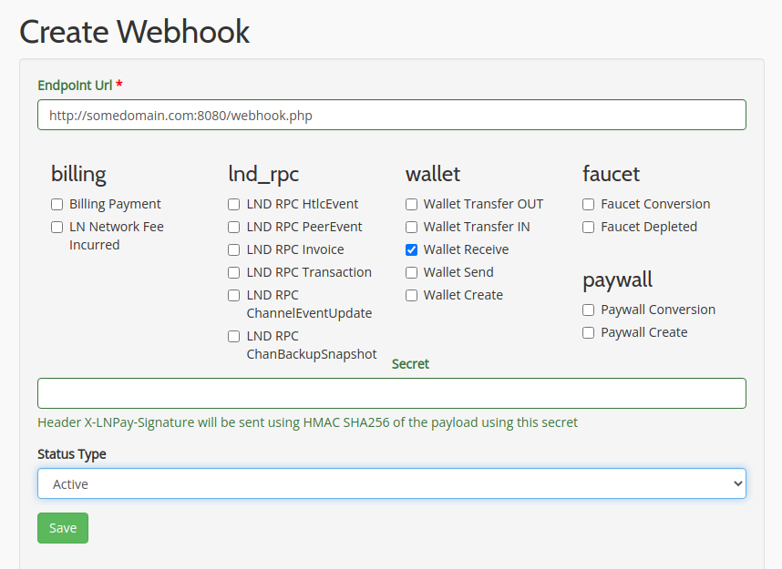

# Real-time Bitcoin Lightning Network Twitter Banner
Make your Twitter profile more appealing by showing real-time LN wallet balance.

Live demo: 
- https://twitter.com/roaringstars

---
## Prerequisites
- Server with Docker installed
- Active Twitter App
- LNPay Public API Key [(detail)](docs/setup-ln-pay-api.md)
- LN Adddress [(detail)](docs/setup-ln-address.md)
---
## Setup
### 1. Replace `.env` config
Replace required info with your own key.

### 2.Run the container
```bash
docker-compose up -d
docker-compose exec app bash
```
Something like this will be shown
```
$ docker-compose up -d
Creating network "twitter-bitcoin-wallet_local" with the default driver
Creating volume "twitter-bitcoin-wallet_composer_cache" with default driver
Creating app-twitter-bitcoin-wallet ... done
$ docker-compose exec app bash 
root@928c45cf3398:/app#
```

### 3. Install dependency
And do install the dependency (inside Docker container, after run `docker-compose exec app bash` command)
```
composer install
```

### 4.  Test the app
- If you're doing it correctly, you'll able to access http://localhost:8080 and showing `:)` emoji.
- Then try to access http://localhost:8080/webhook.php and check your Twitter name and Banner.

### 5. Attach webhook
We need to call this URL every new payment received. Of course, you need some domain and to make your app callable from the outside world.

Go to https://lnpay.co/webhook/create and put your webhook URL.





### 6. Test it!
Now, tell your friends to tip some sats to your choosen LN address, and wait your friends reaction :)
- test420@tinytip.me
