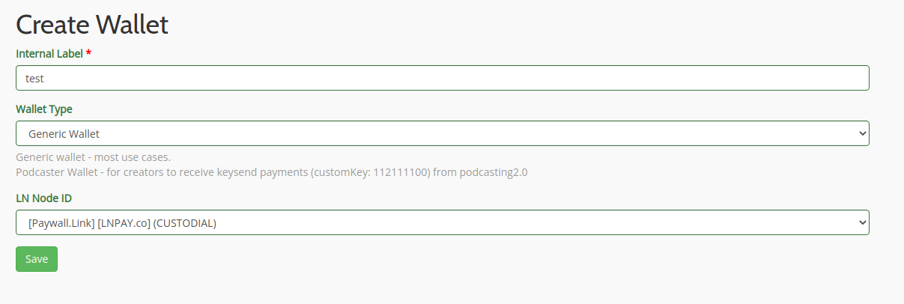
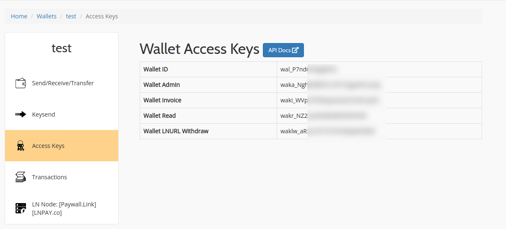

# Setup LNPay API 

## 1. Register LNPay.co account
Go to this link, and register with your E-mail. Verify your email too
- https://lnpay.co/home/signup


## 2. Create new wallet
Go ahead to https://lnpay.co/wallet/create and create your wallet



## 3. Note your API key
You will see some unique (secret) code to access your wallet, keep it private.



And for Pubic API Key & Secret API Key you can get it here.
- https://lnpay.co/developers/dashboard

## 4. Save it to your `.env` file 
Then you need to update your .env file to let this script know how to access your wallet.
```
# .env
# LN Pay Config
LNPAY_PUBLIC_API_KEY=pak_Cxxxxxxxxxxxxx
LNPAY_SECRET_API_KEY=sak_Wrxxxxx
LNPAY_WALLET_KEY=wal_P7xxxx
LNPAY_WALLET_KEY_ADMIN=waka_Nghxxxxxx

```